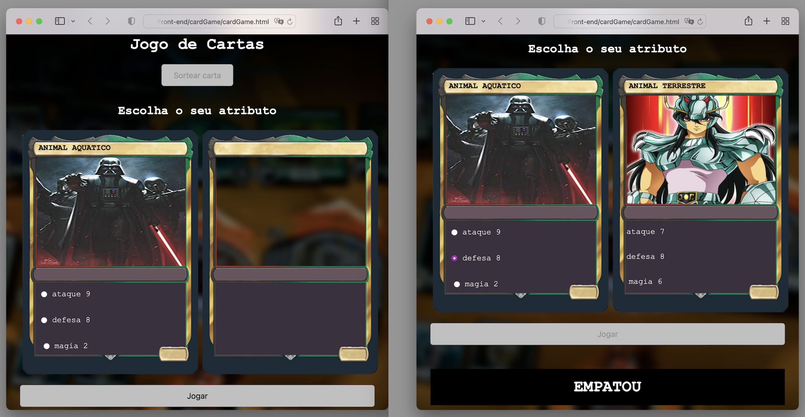

# CardGame

This project is a game, and to start the user needs to click on sort card. Then it will show your card with three options. The user needs to choose one and click play.

So the opponent’s card will appear and the game will measure both cards and indicate who is the winner.

## Project

This project I used HTML to create the website and insert all components, like image, text, and button. There are tags, like html, head, title, body, h1, form, div, and more.

To customise the website, I used CSS which is a style sheet language. In this part was defined font, background, padding, text, color, margin, and more.

JavaScript was used to programming. It gives web pages interactive elements that engage a user. Here, I define variables, functions, conductions, and more.

**Learning about: HTML, CSS, JavaScript, Visual Studio, Website and more.**
##

*This project was developed during the course in Alura school.*
